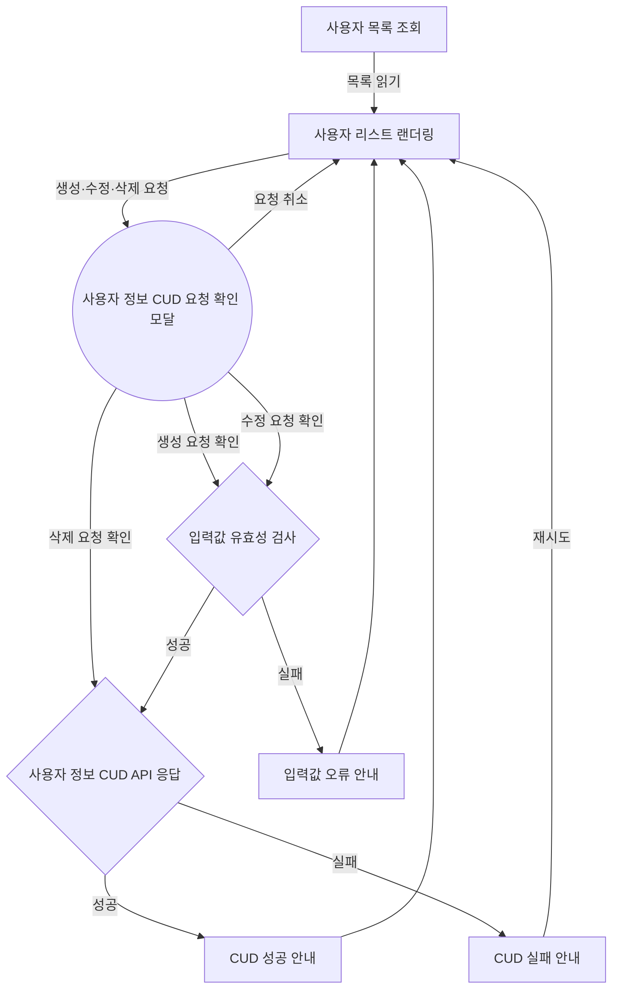
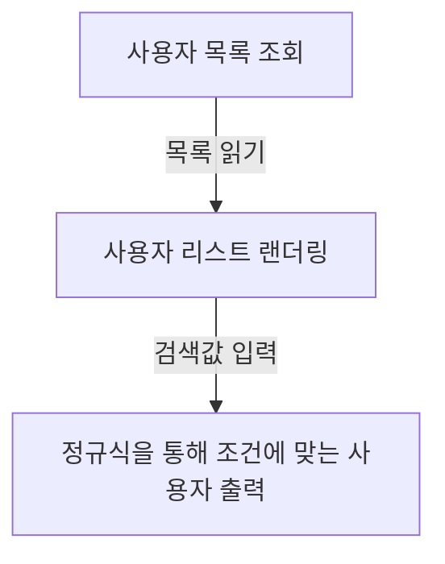
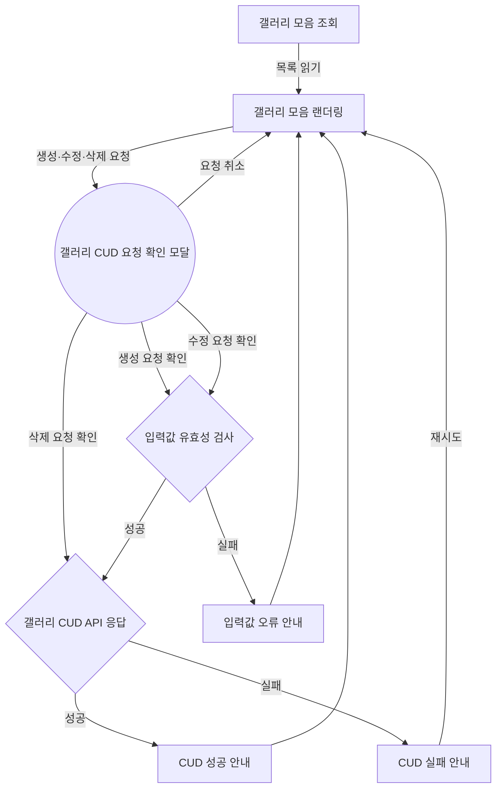
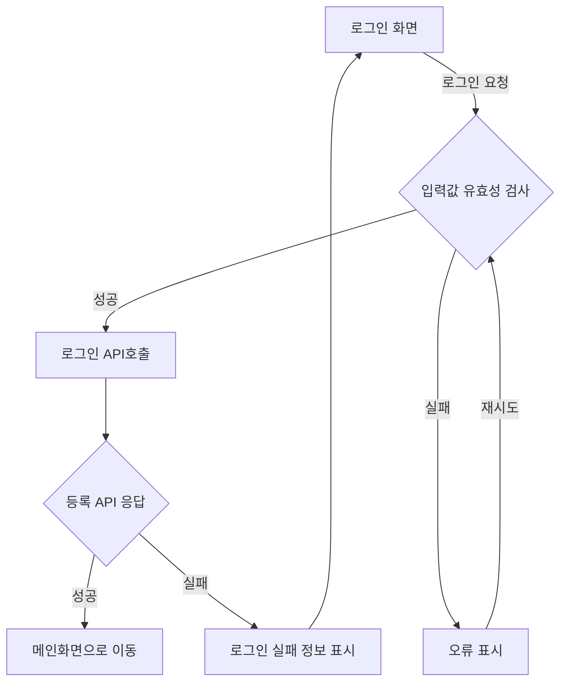
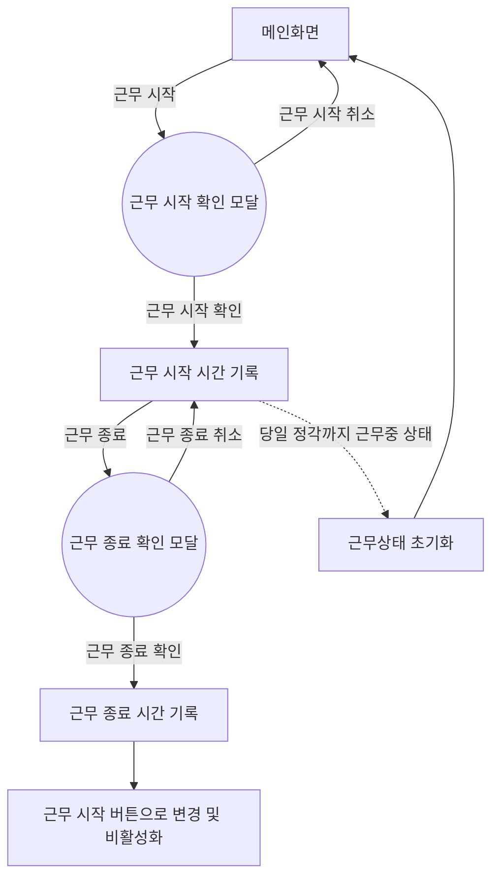
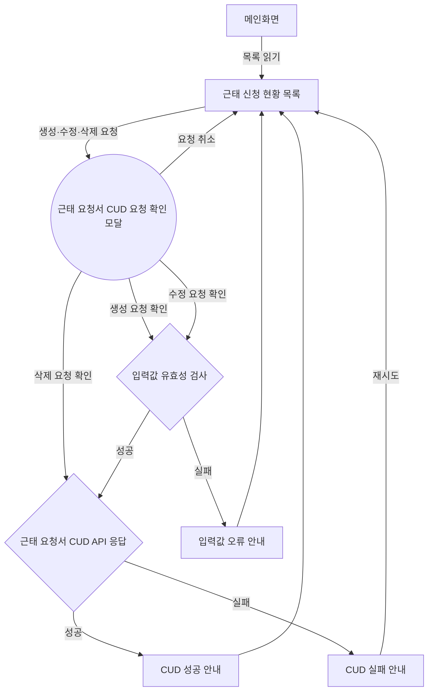
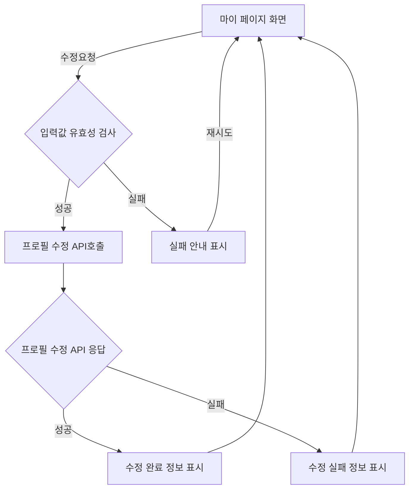

# 기능 정의서

---

## **기능별 설명**

---

\*각 기능별 설명에 들어가야하는 항목

- 기능명
- 기능 설명
- 입력 항목, (유효성 검사 필요), (프론트엔드에서 제공), (자동 생성)
- 사용자 액션
- 플로우

```mermaid

```

---

### 1. 관리자 로그인

- 기능명: 관리자 로그인
- 기능 설명: 관리자 권한으로 로그인
- 입력 항목:
  - 아이디:
    - 문자열
    - 20자 이하
    - 영문과 숫자만 허용됨
    - (유효성 검사 필요)
  - 비밀번호:
    - 문자열
    - 20자 이하
    - 영문과 숫자를 포함한 특수문자((#@!$%^&\*)가 사용 가능
    - (유효성 검사 필요)
- 사용자 액션: 입력 항목을 입력하고 로그인 요청
- 플로우:

```mermaid
flowchart TD
    A[로그인 화면] --> B{입력값 유효성 검사}
    B -->|성공| C[로그인 API호출]
    B -->|실패| D[오류 표시]
    D ---->|재시도| B
    C --> E{등록 API 응답}
    E -->|성공| F[메인화면으로 이동]
    E -->|실패| G[로그인 실패 정보 표시]
    G ----> A
```

### 2. 사용자 정보 crud

- 기능명: 사용자 정보 crud
- 기능 설명: 관리자 권한으로 사용자 정보 crud
- 입력 항목
  - 사진:
    - 이미지파일(png, jpg)
    - 사진 용량(5~10MB)
    - (유효성 검사 필요)
  - 이름
    - 문자열, 10자 이하
  - 사용자(직원) 아이디:
    - 문자열, 10자 이하
    - 임의로 지정된 아이디가 자동으로 생성됨
      - 사원번호(총 8자리)
      - 정규직/계약직인지 알파벳 1자리
      - H : Hire, 정규직
      - C: Contract, 계약직
      - 입사년도 2자리
      - 직군&직무 고유번호 2자리
      - 입사순서 3자리
      - 예1) H2410014, C2319005
    - (자동 생성)
  - 사용자(직원) 비밀번호
    - 문자열, 10자 이하
    - 비밀번호 검증 로직
    - 임의로 지정된 숫자(예시 1111가 자동 생성됨)
    - (자동 생성)
  - 이메일
    - 문자열, 30자 이하
    - 이메일 형식( 사용자명@도메인 형식)
    - (유효성 검사 필요)
  - 휴대번호:
    - 문자열, 13자 이하(하이픈을 포함한)
      - (하이픈)을 기준으로 첫번째 구간이 01[0,1,6,7,8,9](https://www.notion.so/%ED%95%B8%EB%93%9C%ED%8F%B0), 02(집), 030~099(지역) 중 하나인지 체크
      - (하이픈)을 기준으로 두번째 구간이 숫자 3~4 자리로 이루어져 있는지 체크
      - (하이픈)을 기준으로 세번째 구간이 숫자 4자리로 이루어져 있는지 체크
  - 직급:
    - 문자열, 정해진 문자열 중에 하나 선택
    - 부장/차장/과장/대리
- 사용자 액션: 사용자 정보 생성·조회·수정·삭제
- 플로우:



### 3.사용자 목록에서 이름, 이메일을 통해 사용자 검색

- 기능명: 이름, 이메일을 통해 사용자 검색
- 기능 설명: 검색을 통한 사용자 조회
- 입력 항목
  - 이름:
    - 문자열, 10자 이하
  - 이메일:
    - 문자열, 30자 이하
    - 이메일 형식(name@gmail.com 형식)
- 사용자 액션: 검색창에 찾고자 하는 이름, 이메일을 입력
- 플로우:



### 4.기업 갤러리 crud

- 기능명: 갤러리 crud
- 기능 설명: 관리자 권한으로 갤러리 crud
- 입력 항목:
  - 사진:
    - 사진 파일(png, jpg)
    - 사진 용량(최대 50MB)
  - 제목:
    - 문자열, 20자
  - 내용:
    - 문자열, 200자
- 사용자 액션: 갤러리 생성·조회·수정·삭제
- 플로우:



### 5.사용자 로그인

- 기능명: 사용자 로그인
- 기능 설명: 사용자 로그인
- 입력 항목
  - 아이디:
    - 문자열, 20자 이하
    - 영문과 숫자만 허용됨
    - (유효성 검사 필요)
  - 비밀번호:
    - 문자열, 20자 이하
    - 영문과 숫자를 포함한 특수문자((#@!$%^&\*)가 사용 가능
    - (유효성 검사 필요)
- 사용자 액션: 아이디, 비밀번호 입력
- 플로우:



### 6.사용자 근무 시작/종료(근무초기화 로직도 함께)

- 기능명: 사용자 근무시간 펀쳐
- 기능 설명: 사용자가 근무 시작/종료 버튼을 통하여 근무시간을 기록
- 입력 항목:
  - 버튼 클릭시 현재시간(클릭 액션으로 입력) YYYY-MM-DD hh-mm-ss (2024-06-08)
- 사용자 액션: 버튼 클릭
- 플로우:



### 7.근태 신청 및 현황 파악

- 기능명: 사용자 근태 게시글
- 기능 설명: 사용자 근태 신청및 현황을 목록으로 파악
- 입력 항목
  - 제목:
    - 문자열, 20자
  - 내용(부재 사유):
    - 문자열, 200자
  - 날짜(근태 일정)
    - Date 타입
    - YYYY-MM-DD (2024-06-08)
- 사용자 액션: 글 작성 및 게시 요청
- 플로우:



### 8.프로필 수정

- 기능명: 개인 프로필 수정
- 기능 설명: 사용자의 개인 프로필을 조회 및 수정
- 입력 항목
  - 사진:
    - 사진 파일(png, jpg), 최대 용량(5~10MB)
  - 이름:
    - 문자열, 10자 이하
    - (유효성 검사 필요)
  - 이메일:
    - 문자열, 30자 이하
    - 이메일 형식(이름@도메인 형식)
    - (유효성 검사 필요)
  - 휴대번호 :
    - 문자열, 20자 이하
    - (유효성 검사 필요)
- 사용자 액션: 정보 수정 후 저장


